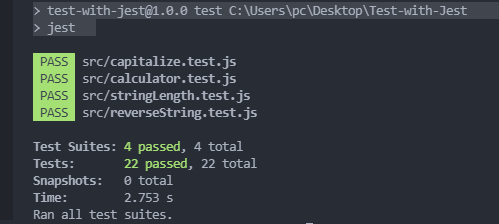

# Test with Jest

## Screenshots

## General info
Testing some pure functions with Jest,
JavaScript Testing Framework with a focus on simplicity.

	
## Technologies
Project is created with:
* Javascript

## Setup
To run this project, install it locally using:
$ cd Desktop
$ git clone https://github.com/VuDej/Test-with-Jest.git
$ npm install --save-dev jest
$ npm test

## Author

👤 **Dejan Vujovic**

- Github : [@VuDej](https://github.com/VuDej)
- Twitter: [@DejanVuj](https://twitter.com/DejanVuj)
- LinkdIn : [@Dejan-Vujovic](https://www.linkedin.com/in/dejan-vujovic-5a0672225/)

## 🤝 Contributing

Contributions, issues, and feature requests are welcome!

Feel free to check the [issues page](https://github.com/VuDej/Test-with-Jest/issues).

## Show your support

Give a ⭐️ if you like this project!

## Acknowledgments

- A special thanks to Microverse.

## 📝 License

This project is [MIT](LICENSE) licensed.

## Contact
Created by [@VuDej](https://github.com/VuDej) - feel free to contact me!

